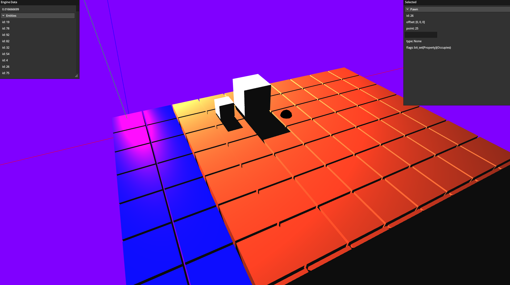

Example project which implements the following:

- 3D rendering written in OpenGl with the ability to render objects with assigned materials.
- Dynamic shadow/light rendering.
- Hot reloading of assets (shaders from files) and asset managing.
- Hot reloading of game and ui code; See package game and reload.bat.
- Integration of an immediate mode gui (microui)
- Ui for showing entity information through type reflection.
- Basic collision for picking entities.

Note it only works _easily_ on windows currently since the Odin vendor library doesn't provide 
the library for glfw on linux.

